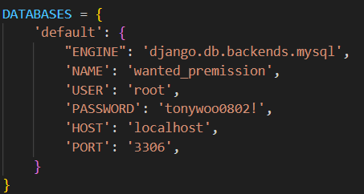
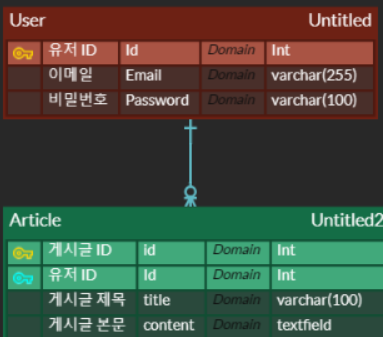

# wanted-pre-onboarding-backend
원티드 프리 온보딩 프로젝트
## 지원자의 성명
우영택
<br>

## 애플리케이션의 실행 방법 (엔드포인트 호출 방법 포함)


1. 이 레포지토리를 git clone
   <br>

2. (생략가능) 레포지토리를 저장한 디렉토리 혹은 wanted-pre-onboarding-backend 폴더 안에 python 가상환경 생성
   - ex : 터미널에서 cd wanted-pre-onboarding-backend 후
   - python -m venv {가상환경이름}
  <br>

3. 가상환경 생성한 디렉토리에서 가상환경 activate
   - source venv/Scripts/activate
  <br>
  
4. pip install -r requirement.txt 명령어로 가상환경에 라이브러리 설치
   - wanted-pre-onboarding-backend 디렉토리 안에 있음
  <br>
    
5. wanted-pre-onboarding-backend/preonboarding/preonboarding/settings.py에서 DATABASES를 수정
   - 
   - NAME : 스키마 이름
   - USER : 유저 이름
   - PASSWORD : mysql 비밀번호
  <br>

6. python manage.py makemigrations 후 python manage.py migrate 진행하여 migrate 진행 
    - wanted-pre-onboarding-backend/preonboarding에서 실행
  <br>
7. python manage.py runserver 로 서버 실행
  <br>

8. postman 등 api 테스트 툴을 통해 엔드 포인트 호출
<br>

## 데이터베이스 테이블 구조

<br>

## 구현한 API의 동작을 촬영한 데모 영상 링크
https://drive.google.com/file/d/1ZlGEeoFZpXk2NlTZCnbZW5uWTMDEAh5R/view?usp=sharing

## 구현 방법 및 이유에 대한 간략한 설명
<hr>


1. User의 경우 drf의 기본 auth 기능과 모델을 사용하지 않고, 커스터마이징하여 사용.
    - 요구사항의 email, password 유효성 검증에 비해 drf auth는 복잡한 검증을 하기 때문.
    - 현재 email에 @가 들어가있는지, password는 8자 이상인지만 검증. + email은 unique 요소이기 때문에 중복 email도 검증
    - email은 email field가 아닌 이유도 정규식을 통해 @의 유무 뿐 아니라, . 의 유무도 확인하기 때문. 
<br>

2. password는 argon2 알고리즘으로 해싱
   - 기본 django auth 모델을 커스터마이징하여 자체 암호화 기능 사용이 힘들었고 argon2 자체가 현재 주목받고 있는 알고리즘이라고 알고있음.
<br>

3. django-simplejwt를 통해 jwt를 발급하고, 쿠키에 세팅. pyjwt 모듈을 통해 jwt를 decode 
    - accounts.views에 별도의 함수를 만들어 jwt인증이 필요한 기능마다 불러올 수 있도록 했음
<br>

4. articles 도메인의 경우 inner 함수로 구현. 코드의 중복을 줄임. 
<br>

5. articles_list의 경우, Article에 저장된 데이터를 최신순으로 볼 수 있게 -pk로 정렬하여 가져옴. Paginator를 이용하여 5개의 데이터를 가져옴.
<br>

6. article을 create, update, delete할 때, 3에서 만든 함수를 호출하여, user_pk를 얻은 다음, 허가된 유저인지 판별
   - update, delete의 경우, article.user_id와 현재 user_pk가 같은지 확인 

## API 명세(request/response 포함)

### 1. 회원가입
HTTP method : POST
URL : "/accounts/signup/"
Request 
```bash
{
	"email": str,
	"password": str,
}
```
Response
```bash
성공
{
    'message' : str,
    'refresh' : str,
    'access' : str,
}

실패
{
    "message" : str
}

+ refresh 토큰, access 토큰 cookie에 세팅
```
HTTP STATUS
201 : 회원가입 성공
400 : 이메일, 비밀번호 유효성 검사 실패

### 2. 로그인
HTTP method : POST
URL : "/accounts/login/"
Request 
```bash
{
	"email": str,
	"password": str,
}
```
Response
```bash
성공
{
    "refresh" : str,
    "access" : str,
}

실패
{
    "message" : str
}

+ refresh 토큰, access 토큰 cookie에 세팅
```
HTTP STATUS
200 : 로그인 성공
400 : 이메일, 비밀번호 유효성 검사 실패

### 3. 게시글 목록
HTTP Method : GET
URL : "/articles/"
Request 
```bash
{
	"page": int(생략가능, 생략시 default 1페이지),
}
```
Response
```bash
{
    "data" : lists,
}

```
HTTP STATUS
200 : 조회 성공

### 4. 게시글 생성
HTTP Method : POST
URL : "/articles/"
Request 
```bash
{
	"title": str,
	"content": str,
}
```
Response
```bash
성공
{
    "data" : dict(object),
}

실패
{
    "message" : str
}
```
HTTP STATUS
201 : 게시글 생성 성공
400 : 게시글 생성 실패(게시글 제목, 내용이 없는 경우)
401 : 로그인 안한 유저 접근

### 5. 단일 게시글 조회
HTTP Method : GET
URL : "/articles/<article_pk>/"
Request 
```bash

```
Response
```bash
{
    "data" : dict(object),
}

```
HTTP STATUS
200 : 조회 성공

### 6. 게시글 수정
HTTP Method : PUT
URL : "/articles/<article_pk>/"
Request 
```bash
{
	"title": str,
	"content": str,
}
```
Response
```bash
성공
{
    "data" : dict(object),
}

실패
{
    "message" : str
}
```
HTTP STATUS
200 : 게시글 수정 성공
400 : 게시글 수정 실패(잘못된 유저 접근, title, content가 비어있는 경우)

### 7. 게시글 삭제
HTTP Method : DELETE
URL : "/articles/<article_pk>/"
Request 
```bash
```
Response
```bash
http status만 반환
```
HTTP STATUS
204 : 게시글 삭제 성공
400 : 게시글 삭제 실패(잘못된 유저 접근)

